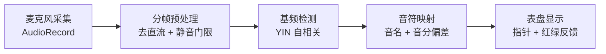

# 吉他调音器 App 开发文档

> 版本：v1.3 · 日期：2026-08-13  
> 平台：仅 Android（原生 Kotlin + Jetpack Compose）· 已于 v1.1 确认（见 2.1 决策记录）  
> 目标：通过手机麦克风采集吉他声音 → 计算基频 → 与标准调弦频率对比 → 实现调音。  
> 核心能力：实时基频检测、音符识别、音分偏差显示、红/绿调准反馈。

**变更记录**

| 版本   | 日期         | 变更                                                                              |
| ---- | ---------- | ------------------------------------------------------------------------------- |
| v1.0 | 2026-08-13 | 初版：完整技术方案、算法、工程结构、里程碑                                                           |
| v1.1 | 2026-08-13 | 确认目标平台为原生 Kotlin（仅 Android）；排除 Flutter 备选并新增 ADR；补充 Oboe 升级路径、Compose 性能细节与待确认项 |
| v1.2 | 2026-08-13 | 确认调弦范围：吉他标准 + 降调（drop-D / drop-C）、尤克里里标准 + 降调（降半音 / 降全音）；§6 调弦表、§4.3 参数、§8 UI、§10 结构、§11 验收、§12/§13 验证同步更新 |
| v1.3 | 2026-08-13 | 确认交付节奏与音频策略：先交付「核心 DSP + 单元测试」（M1 先行验收）；Oboe 暂不启用，列为 M4 条件触发项（见 §11 交付策略、§14） |

---

## 1. 项目概述

目标平台：**仅 Android**，采用原生 Kotlin + Jetpack Compose 实现（v1.1 已确认，不涉及 iOS / 跨平台方案）。

调音器是一个**实时音频 + 信号处理**类应用。工作闭环如下：

> 拨弦 → 麦克风采集波形 → 分帧预处理 → 基频检测（YIN）→ 音符映射（音名 + 音分）→ 表盘显示

它**没有后端、没有数据库**，全部计算在本地完成。核心难点不是 UI，而是那条**实时信号处理链路**的精度与延迟。

---

## 2. 技术栈选型

| 层    | 推荐选型            | 说明                                  |
| ---- | --------------- | ----------------------------------- |
| 语言   | Kotlin（已确认）     | 安卓官方首选                              |
| UI   | Jetpack Compose | 表盘/指针用 Canvas 绘制                    |
| 音频采集 | AudioRecord     | 44.1 kHz / 16-bit PCM / 单声道，直接拿原始波形 |
| 基频检测 | YIN 算法          | 自相关改进版，~100 行，无第三方依赖                |
| 备用库  | TarsosDSP       | 现成的 YIN/MPM/FFT，不想手写时使用             |
| 权限   | RECORD_AUDIO    | 运行时申请的危险权限                          |
| 构建   | Gradle / AGP    | 标准安卓工具链                             |

**已确认不采用**

- Flutter（跨平台）：v1.1 已确认排除。理由：本项目核心难点是实时音频链路的精度与延迟，原生 `AudioRecord` 零桥接直读 PCM；Flutter 依赖 `record` 插件经原生↔Dart 通道桥接回传，延迟抖动难控制；且无 iOS 需求，跨平台收益为零。完整论证见 2.1。

**性能优化选项（按需启用，非备选框架）**

- Oboe（AAudio）：低延迟采集路径，仅当 M4 实测端到端延迟 > 100 ms 时启用，回调运行在 native 线程。
- NDK C++ 重写 `PitchDetector`：仅当纯 Kotlin 逐样本自相关 CPU 占用过高时启用（见 9.5）。

### 2.1 技术决策记录（ADR）

**D1 · 目标平台 = 原生 Kotlin（仅 Android）· 2026-08-13 确认**

| 项    | 内容                                                                                                                                                  |
| ---- | --------------------------------------------------------------------------------------------------------------------------------------------------- |
| 决策   | 原生 Kotlin + Jetpack Compose，仅支持 Android                                                                                                             |
| 背景   | 无 iOS / 桌面端需求；核心难点是实时信号链路的精度与延迟，而非 UI                                                                                                               |
| 备选方案 | Flutter（跨平台）、Kotlin Multiplatform                                                                                                                   |
| 决策理由 | ① `AudioRecord` 零桥接直读 PCM，链路最短、延迟可控；② YIN 算法纯 Kotlin 直接实现，CPU 吃紧可平移 NDK 而不改架构；③ Android 官方工具链 / 文档 / 调试最成熟；④ 无跨端需求时 Flutter 的跨平台收益为零，反而引入桥接层与插件不确定性 |
| 后果   | 未来若需 iOS：方案 A 用 Swift 重写整套 App；方案 B 将 DSP 抽为共享 C++ 库，经 JNI / Kotlin/Native 复用                                                                       |

---

## 3. 系统架构与数据流

实时循环（第 2~5 步每收到一帧音频就执行一次）：



各阶段职责：

1. **麦克风采集**：AudioRecord 以 44.1 kHz / 16-bit PCM / 单声道读取原始 PCM。
2. **分帧与预处理**：切成固定长度帧；去直流分量；用 RMS 做静音检测（无人弹奏时返回 `null`）。
3. **基频检测**：YIN 算法从一帧波形中估计基频 `f0`。
4. **音符映射**：`f0` → 音名 + 相对目标频率的音分偏差 `cents`。
5. **表盘显示**：Compose 绘制指针，`|cents| < 5` 变绿表示调准。

---

## 4. 核心算法：YIN 基频检测

### 4.1 为什么不用 FFT 直接找峰值

吉他低频（E2 = 82.41 Hz）用 FFT 需要极长点数才能分辨 1 Hz 的误差；而调音器要求 ±1 音分（E2 下 1 音分 ≈ 0.05 Hz）的精度。**YIN 是自相关法的改进，天然适合单音低音调音**。

### 4.2 YIN 四步原理

1. **差分函数** `d(τ) = Σ (x[j] − x[j+τ])²` —— τ 是候选周期。
2. **累积均值归一化** `d'(τ) = d(τ)·τ / Σ d(j)` —— 抑制倍频错误（吉他泛音丰富，普通自相关常把 82 Hz 误判成 164 Hz）。
3. **阈值检测** —— 找第一个 `d'(τ) < 0.15` 的 τ，再向后找局部最小。
4. **抛物线插值** —— 用相邻三点拟合，得到亚采样精度的周期 → `f0 = fs / τ`。

### 4.3 参数说明

| 参数           | 推荐值            | 依据                                             |
| ------------ | -------------- | ---------------------------------------------- |
| 采样率 fs       | 44100 Hz       | 标准，覆盖吉他全频段                                     |
| 帧长 N         | 2048 点（~46 ms） | E2 周期约 535 样本，2048 点含约 3.8 个周期                 |
| fmin         | 55 Hz          | 覆盖最低音：吉他 drop-C 的 C2 = 65.41 Hz、尤克里里降全音 A#3 = 233.08 Hz，τmax ≈ 802 |
| fmax         | 1200 Hz        | 高于吉他最高弦 E4，限制搜索区间避免误判                          |
| 阈值 threshold | 0.15           | YIN 论文经验值，可调 0.1~0.2                           |

### 4.4 Kotlin 实现

```kotlin
object PitchDetector {
    fun detect(frame: ShortArray, sampleRate: Int, fmin: Float = 55f): Float? {
        val n = frame.size
        val tauMax = (sampleRate / fmin).toInt()          // 55Hz → τmax≈802，覆盖降调
        val cmnd = FloatArray(tauMax + 1)
        cmnd[0] = 1f
        var running = 0f
        for (tau in 1..tauMax) {                          // 差分函数 + 累积均值归一化
            var s = 0f
            for (j in 0 until n - tau) {
                val d = frame[j] - frame[j + tau]
                s += d * d
            }
            running += s
            cmnd[tau] = if (running > 0f) s * tau / running else 1f
        }
        var tauEst = -1
        for (tau in (sampleRate / 1200).toInt()..tauMax) {   // 阈值 + 局部最小
            if (cmnd[tau] < 0.15f) {
                while (tau + 1 <= tauMax && cmnd[tau + 1] < cmnd[tau]) tau++
                tauEst = tau; break
            }
        }
        if (tauEst < 0) return null
        var tauRef = tauEst.toFloat()
        if (tauEst in 1 until tauMax) {                   // 抛物线插值
            val s0 = cmnd[tauEst - 1]; val s1 = cmnd[tauEst]; val s2 = cmnd[tauEst + 1]
            val denom = 2f * (2f * s1 - s2 - s0)
            if (denom != 0f) tauRef = tauEst + (s2 - s0) / denom
        }
        return sampleRate / tauRef
    }
}
```

---

## 5. 音符映射与音分计算

频率到音名用 MIDI 编号换算：

```
midi    = 69 + 12 × log2(f0 / 440)
音分偏差 = 1200 × log2(f0 / 目标频率)   // 正 = 偏高(#)，负 = 偏低(b)
```

```kotlin
val NOTE_NAMES = arrayOf("C","C#","D","D#","E","F","F#","G","G#","A","A#","B")

fun freqToNote(f0: Float): Pair<String, Int> {
    val midi = Math.round(69 + 12 * Math.log(f0 / 440.0) / Math.log(2.0)).toInt()
    return NOTE_NAMES[Math.floorMod(midi, 12)] to (midi / 12 - 1)
}

fun cents(f0: Float, target: Float): Float =
    1200f * (Math.log(f0 / target).toFloat() / Math.log(2.0))
```

表盘逻辑：指针位置 = `cents` 截断到 ±50；`|cents| < 5` 变绿表示已调准。

---

## 6. 调弦频率表

所有频率由通用公式 `f = 440 × 2^((midi − 69) / 12)` 计算；降调 = 对基准调弦整体移调（UI 提供半音移调 −12 ~ 0 半音）。

### 6.1 吉他（6 弦）

**标准调弦（EADGBE）**

| 弦      | 音名 | MIDI | 频率 (Hz) |
| ------ | -- | ---- | ------- |
| 1 弦（高） | E4 | 64   | 329.63  |
| 2 弦    | B3 | 59   | 246.94  |
| 3 弦    | G3 | 55   | 196.00  |
| 4 弦    | D3 | 50   | 146.83  |
| 5 弦    | A2 | 45   | 110.00  |
| 6 弦（低） | E2 | 40   | 82.41   |

**降调（仅 6 弦降低，5~1 弦不变）**

| 方案    | 6 弦音名 | MIDI | 频率 (Hz) | 说明          |
| ------ | ----- | ---- | ------- | ----------- |
| drop-D | D2    | 38   | 73.42   | 6 弦降全音       |
| drop-C | C2    | 36   | 65.41   | 6 弦降全音 + 半音  |
| 整体降半音 | —     | —    | ×2^(−1/12) | 可选：全部 6 弦 −1 半音 |

### 6.2 尤克里里（4 弦，高音 G re-entrant 调弦）

**标准调弦（GCEA）**

| 弦            | 音名 | MIDI | 频率 (Hz) |
| ------------ | -- | ---- | ------- |
| 4 弦（re-entrant 高音 G） | G4 | 67   | 392.00  |
| 3 弦          | C4 | 60   | 261.63  |
| 2 弦          | E4 | 64   | 329.63  |
| 1 弦（最高）     | A4 | 69   | 440.00  |

**降调（整体移调）**

| 方案   | 各弦音名（4→1 弦）      | 各弦频率 (Hz)（4→1 弦）        |
| ---- | ----------------- | ---------------------- |
| 降半音  | F#4 · B3 · D#4 · G#4 | 369.99 · 246.94 · 311.13 · 415.30 |
| 降全音  | F4 · A#3 · D4 · G4  | 349.23 · 233.08 · 293.66 · 392.00 |

---

## 7. 音频采集实现

### 7.1 权限

`AndroidManifest.xml`：

```xml
<uses-permission android:name="android.permission.RECORD_AUDIO" />
```

运行时用 `ActivityResultContracts.RequestPermission` 申请，拒绝时优雅降级（提示无法录音）。

### 7.2 AudioRecord 采集循环

```kotlin
val sampleRate = 44100
val minBuf = AudioRecord.getMinBufferSize(
    sampleRate, AudioFormat.CHANNEL_IN_MONO, AudioFormat.ENCODING_PCM_16BIT)

fun start(onPitch: (Float?) -> Unit) {
    val rec = AudioRecord(MediaRecorder.AudioSource.MIC, sampleRate,
        AudioFormat.CHANNEL_IN_MONO, AudioFormat.ENCODING_PCM_16BIT, minBuf * 2)
    rec.startRecording()
    thread {
        val frame = ShortArray(2048); var pos = 0; val tmp = ShortArray(minBuf)
        while (!stopped) {
            val n = rec.read(tmp, 0, tmp.size)
            for (i in 0 until n) {
                frame[pos++] = tmp[i]
                if (pos == frame.size) {
                    pos = 0
                    if (rms(frame) > SILENCE_THRESHOLD)
                        onPitch(PitchDetector.detect(frame, sampleRate))
                    else
                        onPitch(null)
                }
            }
        }
        rec.stop(); rec.release()
    }
}
```

> `rms()` 为均方根幅值计算，用于静音检测；`SILENCE_THRESHOLD` 建议约 -50 dBFS，需真机标定。
>
> **最低版本与低延迟升级路径**：建议 `minSdk = 26`（Android 8.0，覆盖绝大多数存量设备，且系统低延迟音频路径已成熟）。若 M4 真机实测端到端延迟 > 100 ms，升级为 Oboe（AAudio）采集——音频回调运行在 native 线程，`PitchDetector` 相应改为 C++ 或经 JNI 调用（见 2.1 性能优化选项）。

---

## 8. UI 设计（表盘）

用 Compose Canvas 绘制：

- **中央**：显示当前检测音名（如 "A"）与八度（如 "2"）。
- **指针表盘**：量程 -50 ~ +50 音分，指针位置随 `cents` 移动；`|cents| < 5` 区域标绿，其余标红/黄。
- **乐器与调弦选择**：两级选择——乐器（吉他 / 尤克里里）→ 调弦方案（标准 / 降调），随后显示对应弦位按钮（吉他 6 个 / 尤克里里 4 个），可切换目标频率；降调用半音移调（−12 ~ 0 半音）实现。
- **结果平滑**：对连续帧的 `cents` 做中值滤波或指数平滑，避免指针抖动。

---

## 9. 工程实现细节与坑

1. **权限**：`RECORD_AUDIO` 是危险权限，需运行时申请；拒绝后提示并禁用检测。
2. **静音检测**：无人弹奏时 YIN 会给出乱跳的假频率。用 RMS 门限 + 迟滞区间（避免临界值附近闪烁）抑制。
3. **实时性 / 帧长权衡**：帧长越长低频分辨率越好但延迟越高。2048 点（46 ms）是平衡点，端到端延迟可压到 100 ms 内。
4. **结果平滑**：多帧 `cents` 做中值/指数平滑，指针才稳。
5. **性能**：纯 Kotlin 逐样本自相关，一帧 2048 点在主流手机约几毫秒；若 CPU 吃紧，把 `PitchDetector` 挪到 C++/NDK，或用 FFT 加速自相关（自相关 = 功率谱的 IFFT）。
6. **音频焦点与释放**：切后台/锁屏时 `stopRecording()` + `release()`，避免占用麦克风导致其他 App 无法录音。
7. **Compose 重组频率**：指针位置随 `cents` 高频更新，将状态更新节流到 ~30 fps（约每 3 帧音频更新一次），且 DSP 计算保持在采集子线程、仅把结果状态抛回 UI 线程，避免重组风暴与 UI 卡顿。

---

## 10. 项目结构建议

```
guitar-tuner/
├── app/
│   ├── src/main/
│   │   ├── java/com/example/guitartuner/
│   │   │   ├── MainActivity.kt          # 入口 + Compose UI
│   │   │   ├── audio/
│   │   │   │   └── AudioEngine.kt        # AudioRecord 采集线程
│   │   │   ├── dsp/
│   │   │   │   └── PitchDetector.kt      # YIN 算法
│   │   │   ├── music/
│   │   │   │   ├── Tunings.kt            # 调弦定义（吉他/尤克里里 × 标准/降调）
│   │   │   │   └── NoteMapper.kt         # 频率 → 音名/音分
│   │   │   └── ui/
│   │   │       └── TunerScreen.kt        # 表盘 Compose
│   │   ├── res/
│   │   └── AndroidManifest.xml           # RECORD_AUDIO 权限
│   └── build.gradle.kts
├── build.gradle.kts
└── settings.gradle.kts
```

---

## 11. 开发里程碑

**交付策略（v1.3 确认）**：M1 先行交付并验收——首期交付物为「核心 DSP 逻辑 + 单元测试」（纯 JVM 可跑，不依赖手机），验收通过后再推进 M2~M5；Oboe（AAudio）不预先集成，仅在 M4 实测端到端延迟 > 100 ms 或指针明显滞后时作为条件触发项启用（升级路径见 2.1、7.2）。

| 里程碑          | 内容                      | 验收标准                 |
| ------------ | ----------------------- | -------------------- |
| M1 核心 DSP    | `PitchDetector` + `NoteMapper` + 单元测试 | 合成正弦波检测误差 ≤ 1 音分，覆盖全部调弦方案（§12.1 用例） |
| M2 音频采集      | AudioRecord + 权限 + 静音门限 | 真机能连续稳定读取 PCM        |
| M3 音符映射 + UI | 音名/音分换算 + 表盘            | 拨弦显示正确音名和偏差（覆盖全部调弦方案）    |
| M4 真机调优      | 延迟、平滑、稳定性               | 指针稳定、无假音、延迟 < 100 ms |
| M5 打包发布      | 签名 APK/AAB              | 可安装运行                |

---

## 12. 算法验证结果

用 Python 复现 YIN，对 6 根弦的合成正弦波（44.1 kHz，300 ms 帧）做离线验证：

| 弦  | 标准频率 (Hz) | 检测频率 (Hz) | 误差 (cents) |
| -- | --------- | --------- | ---------- |
| E2 | 82.41     | 82.41     | +0.00      |
| A2 | 110.00    | 110.00    | +0.00      |
| D3 | 146.83    | 146.83    | +0.01      |
| G3 | 196.00    | 196.00    | +0.02      |
| B3 | 246.94    | 246.94    | +0.01      |
| E4 | 329.63    | 329.64    | +0.04      |

**结论**：吉他标准调弦最大误差 0.04 音分，远优于调音器 ±1 音分的实用精度要求。

### 12.1 扩展调弦方案验证（v1.2 · 2026-08-13）

同一脚本对全部支持调弦做合成正弦波离线验证（44.1 kHz，300 ms 帧），每方案列出最低音、最高音与整体最大误差：

| 调弦方案 | 弦数 | 最低音 (Hz) | 最高音 (Hz) | 最大误差 (cents) |
| ---- | -- | ------- | ------- | ----------- |
| 吉他标准 EADGBE | 6   | E2 82.41    | E4 329.63   | +0.04       |
| 吉他 drop-D    | 6   | D2 73.42    | E4 329.63   | +0.04       |
| 吉他 drop-C    | 6   | C2 65.41    | E4 329.63   | +0.04       |
| 尤克里里标准 GCEA | 4   | G4 392.00   | A4 440.00   | +0.07       |
| 尤克里里降半音    | 4   | F#4 369.99  | G#4 415.30  | +0.07       |
| 尤克里里降全音    | 4   | F4 349.23   | G4 392.00   | +0.04       |

**结论**：6 套调弦共 30 个音，最大误差 0.07 音分（尤克里里 A4），全部远优于 ±1 音分要求；现有参数（`fmin = 55 Hz`、帧长 2048 点）无需因支持范围扩大而调整。

> 说明：离线验证为求清晰用了 300 ms 帧；实时 App 用 2048 点（46 ms）帧，精度仍可满足要求，需在真机上用真实吉他进一步标定。

---

## 13. 附录：Python 验证脚本

```python
import math

TUNINGS = {
    "吉他标准 EADGBE":  [("E2", 40), ("A2", 45), ("D3", 50), ("G3", 55), ("B3", 59), ("E4", 64)],
    "吉他 drop-D":      [("D2", 38), ("A2", 45), ("D3", 50), ("G3", 55), ("B3", 59), ("E4", 64)],
    "吉他 drop-C":      [("C2", 36), ("A2", 45), ("D3", 50), ("G3", 55), ("B3", 59), ("E4", 64)],
    "尤克里里标准 GCEA": [("G4", 67), ("C4", 60), ("E4", 64), ("A4", 69)],
    "尤克里里降半音":     [("F#4", 66), ("B3", 59), ("D#4", 63), ("G#4", 68)],
    "尤克里里降全音":     [("F4", 65), ("A#3", 58), ("D4", 62), ("G4", 67)],
}

def midi2freq(m):
    return 440.0 * 2 ** ((m - 69) / 12.0)

def yin(samples, fs, fmin=55.0, fmax=1200.0, threshold=0.15):
    n = len(samples)
    tau_max = int(fs / fmin)
    tau_min = max(1, int(fs / fmax))
    cmnd = [0.0] * (tau_max + 1)
    cmnd[0] = 1.0
    running = 0.0
    for tau in range(1, tau_max + 1):
        s = 0.0
        for j in range(n - tau):
            diff = samples[j] - samples[j + tau]
            s += diff * diff
        running += s
        cmnd[tau] = (s * tau / running) if running > 0 else 1.0
    tau_est = -1
    for tau in range(tau_min, tau_max + 1):
        if cmnd[tau] < threshold:
            while tau + 1 <= tau_max and cmnd[tau + 1] < cmnd[tau]:
                tau += 1
            tau_est = tau
            break
    if tau_est < 0:
        return None
    if 0 < tau_est < tau_max:
        s0, s1, s2 = cmnd[tau_est - 1], cmnd[tau_est], cmnd[tau_est + 1]
        denom = 2.0 * (2 * s1 - s2 - s0)
        if denom != 0:
            tau_est = tau_est + (s2 - s0) / denom
    return fs / tau_est

if __name__ == "__main__":
    fs = 44100
    dur = 0.3
    n = int(fs * dur)
    for name, notes in TUNINGS.items():
        for note, midi in notes:
            f0 = midi2freq(midi)
            samples = [math.sin(2 * math.pi * f0 * i / fs) for i in range(n)]
            fdet = yin(samples, fs)
            cents = 1200 * math.log2(fdet / f0) if fdet else float("nan")
            print(f"[{name}] {note:<4} 标准 {f0:>8.2f} Hz  检测 {fdet:>8.2f} Hz  误差 {cents:+.2f} 音分")
```

---

## 14. 后续待确认项

- [x] 目标平台：原生 Kotlin（仅 Android）—— **已确认**（v1.1，见 2.1 ADR D1）
- [x] 是否需要先只交付「核心 DSP 逻辑 + 单元测试」而非完整 App？—— **已确认**：先交付核心 DSP + 单元测试（M1 先行验收，见 §11 交付策略）（v1.3）
- [x] 目标用户是否只需标准调弦（EADGBE），还是需支持降调 / 其他乐器（尤克里里等）？—— **已确认**：吉他标准 + 降调（drop-D / drop-C），尤克里里标准 + 降调（降半音 / 降全音）（v1.2，见 §6）
- [x] M4 真机调优时若延迟 > 100 ms，是否启用 Oboe（AAudio）低延迟采集？—— **已确认**：暂不启用，作为 M4 条件触发项保留（升级路径见 2.1、7.2）（v1.3）
